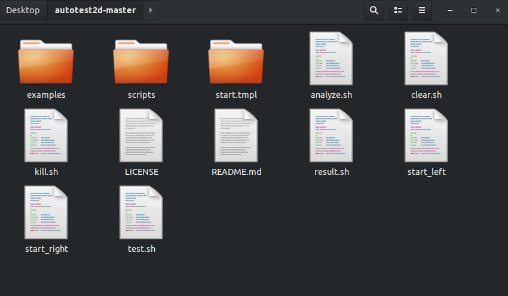
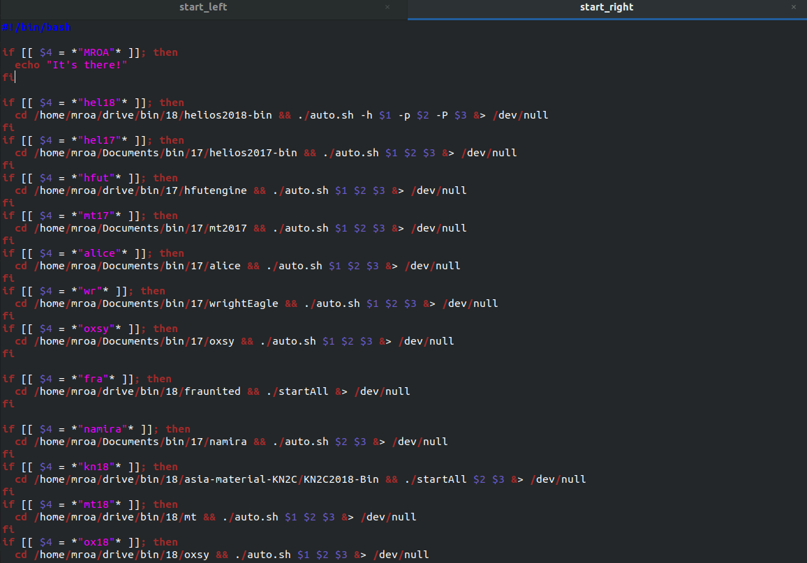
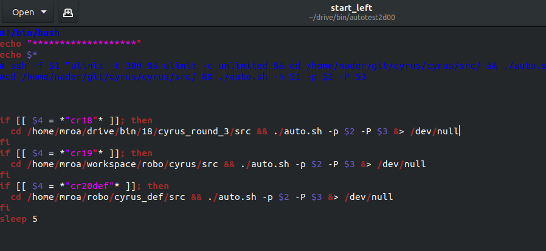

# ابزار اجرا و بررسی بازی AutoTest

ابزاری برای تست و اجرای بازی های بسیار بین دو تیم نوشته شده توسط تیم WrightEagle

- استفاده از ابزار <a herf="https://github.com/wrighteagle2d/lanmonitor">lanmonitor </a> در کنار AutoTest توصیه میشود.

## راه اندازی اولیه

 در صورتی که محیط شبیه سازی و تیم پایه  را روی سیستم خود نصب ندارید میتوانید از <a href="https://rcss.ir/2D/FA/basic/install">اینجا</a> 
 شروع کنید.
 سپس برای دانلود این ابزار به <a href=" https://github.com/wrighteagle2d/autotest2d">این ادرس</a> مراجعه کنید و دانلود کنید.

و به راحتی می توانید آن با archive manager لینوکس از حالت فشرده خارج کنید , در صورت وجود مشکل می توانید از ابزار unzip استفاده کنید.

```bash
sudo apt-get update
sudo apt install unzip
unzip autotest2d-master.zip
```



## فایل های موجود 

* test.sh -- اجرای تست و بازی ها
* kill.sh -- متوقف کننده بازی ها در حال اجرا
* result.sh -- نمایش نتایج
* analyze.sh -- نمایش انالیز و اطلاعات بیشتر در مورد نتایج ( نیازمند ابزار  <a href=" http://www.gnuplot.info/">GNUPlot</a> )
* start\_left -- تنظیمات مربوط به تیم چپ (محل ذخیره سازی تیم چپ , نحوه اجرای آن ها و ...)
* start\_right -- تنظیمات مربوط به تیم راست (محل ذخیره سازی تیم چپ , نحوه اجرای آن ها و ...)
* start.tmpl -- نمونه کد استارت برای برخی از تیم ها
* scripts/automonitor -- باز کننده مانیتور ها به صورت خودکار 

## نحوه استفاده

* با تغییر عدد `PROCES` در  `test.sh` تعداد سرور های در حال اجرا به صورت همزمان را تنظیم میکنید. (هر سرور به صورت خودکار در پورت های جداگانه از هم خواهند شد. )
* با تغییر عدد `ROUNDS` در ‍‍`test.sh` تعداد راند های برای اجرا در هر سرور را مشخص می کنید.
  دقت کنید که  `ROUNDS` * `PROCES` تعداد کلی بازی های شما خواهند بود.
* پورت دیفالت برای اجرا شبیه ساز 6000 است شما می توانید این پورت را برای بازی های خود ازاد بگذارید و `DEFAULT_PORT` را در `test.sh` تغییر دهید.
  نکته: باید عددی که انتخاب میکنید از 6000 بیشتر باشد تا با اجرای دستور rcssserver دچار مشکل نشوید.
* با `CLIENTS` در `test.sh` ادرس سرور ها یا سیستم های دیگری برای اجرا را مشخص خواهید کرد که به صورت دیفالت `loacalhost` یعنی سیستم خودتان است.
* با تغییر‍ `CONTINUE`  در ‍‍`test.sh` از "false" به "true" میتوانید از تست قبلی ادامه دهید و نتایج دو تست با یکدیگر جمع میشوند. و بلعکس با تغییر از "true" به "false" تست جدیدی را شروع کنید.
* با تغییر هر یک از `LOGGING` ها  در ‍‍`test.sh` می توانید بعد از اجرای هر بازی لاگ های آن را داشته باشید.
  * GAME_LOGGING : لاگ RCG
  * TEXT_LOGGING: لاگ RCL
* با تغییر‍ `TEMP`  در ‍‍`test.sh` از "false" به "true" اجازه متوقف و کیل شدن بازی ها را در هر زمان می دهید.(در صورت برخورد هر خطایی دیگر اجرا نشود و یا با دستور kill.sh متوقف شوند.)
* با تغییر‍ `TRAINING`  در ‍‍`test.sh` از "false" به "true" میتوانید از حالت تمرینی بازی استفاده کنید و بلعکس با تغییر از "true" به "false" به حالت عادی بازی برگردید.
* با تغییر هر یک از `FULLSTATE` ها  در ‍‍`test.sh` می توانید تیم آن سمت را فول استیت ران کنید.
  * FULLSTATE_R : تیم راست
  * FULLSTATE_L : تیم چپ

 ``` bash
PROCES=5              #number of simultaneously running servers
ROUNDS=100             #number of games for each server
DEFAULT_PORT=6000      #default port connecting to server
CONTINUE="false"       #continue from last test
GAME_LOGGING="false"   #record RCG logs
TEXT_LOGGING="false"   #record RCL logs
TEMP="false"           #can be killed any time?
TRAINING="false"       #training mode
SYNCH_MODE="1"         #synch mode
FULLSTATE_L="0"        #full state mode for left
FULLSTATE_R="0"        #full state mode for right
 ```


* شما به کد های باینری تیم هایی که میخواهید با آنها تست ران کنید , نیاز دارید که می توانید از ارشیو سایت روبوکاب که از  <a herf="https://archive.robocup.info/Soccer/Simulation/2D/">این لینک</a> در دسترس است استفاده کنید. هر کدام از تیم ها که مد نظرتان بود دانلود و از حالت فشرده خارج کنید.

* فایل های `start_left` و `start_right` را باز کنید و ادرس تیم ها , نام آن ها و نحوه اجرای انها را مشخص کنید.
  

  

* برای مثال های بیشتر می توانید به فولدر start.tmpl مراجعه کنید.

* با استفاده از کد زیر در ترمینال بازی ها و تست را اجرا کنید.

  ```bash
  ./test.sh left_team right_team
  ```

  توجه کنید که `left_team` و `right_team` اسم تیم های است که در`start_left` و `start_right` مشخص کردید.

* برای دیدن نتایج در هر لحظه می توانید از دستور زیر استفاده کنید.

  ```bash
  ./result.sh
  ```


- برای کیل کردن و متوقف کردن بازی ها در هر لحظه می توانید از دستور زیر استفاده کنید.

  ``` b
  ./kill.sh
  ```


## نمونه انلایز هایی که می توانید با اتو تست انجام دهید.

- Game Curve:

  

- Score Map:

  
